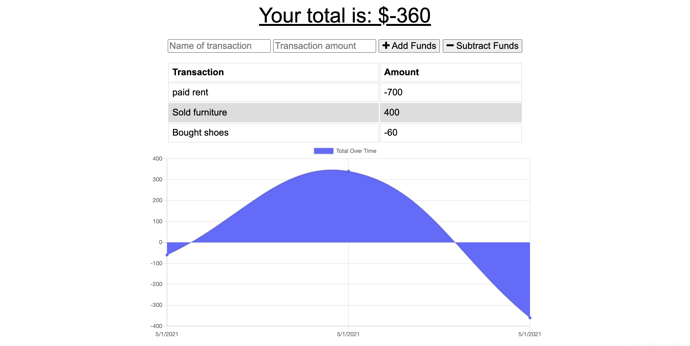

 # Budget-Tracker 

   
  This application allows users to input their income and expenses to track finances and personal budget. 

   

   [Deployed last version](https://arcane-oasis-63453.herokuapp.com/)

   [Github repo](https://github.com/Amal31497/Budget-Tracker)

   

  ## Table of Contents 
 
  ##### * [Technologies used](#Technologies)
  ##### * [Screenshots](#Screenshots)
  ##### * [Credits](#Credits)
  ##### * [License](#License)
  ##### * [Contact Info](#Contact)

  ## Technologies:
   _*Javascript,Node.js,Bootstrap,Others*_

  #### Screenshots:
  

  
  ## Credits:
  [w3schools.com](w3schools.com)
  [MDN](MDN)
  

  ## License: 

  ##### Copyright: Amal Janabayev

  ##### 

  ##### [License Link](https://www.gnu.org/licenses/gpl-3.0.en.html)

  ## Contact: 

  ##### amalj2426@gmail.com
